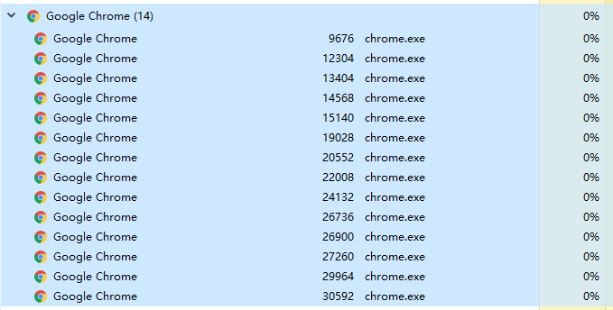

# monitors


[](https://travis-ci.com/Pactortester/monitors)      


## Logo


## 安装


pip install monitors


##  仓库地址：


- github：https://github.com/Pactortester/monitors.git
- pypi：https://pypi.org/project/monitors/#history


## 社区地址


- testerhome：https://testerhome.com/opensource_projects/monitors


## 适用场景


1. 监控某一个进程的性能
2. 根据子进程名称获取到父进程的id,进行性能监控。
- 例如：想监控整个chrome浏览器的系统资源消耗情况
- 只需要传入[chrome.exe] 系统将自动为你监控整个chrome浏览器的资源消耗情况。
## 



## 功能


1. 自动监控此进程的性能情况，控制台实时输出数据
2. 将性能数据以log文件形式存与 [monitor_log] 文件夹


## 命令


```shell
python <you_test_script.py>
```


## Demo


```python
from monitors.monitor_util import monitor_start

monitor_start(name='chrome.exe')
```
